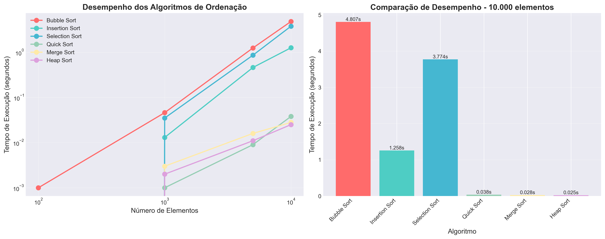

# mapeamento_de_desmatamento
Ordenando dados de desmatamento da Amazônia, com estruturas de ordenação . Praticando estrutura de dados em C 

O objetivo deste trabalho é desenvolver um sistema computacional completo para ordenação e análise de dados de catalogação de imagens de satélite da floresta amazônica, implementando e comparando diferentes algoritmos de ordenação para avaliar seu desempenho em diversos cenários.
O sistema simula o processamento de aproximadamente 100.000 imagens capturadas diariamente por satélites que monitoram a região amazônica, auxiliando na fiscalização de crimes ambientais e no acompanhamento de mudanças na cobertura florestal.
Especificamente, este projeto visa:
•	Implementar no mínimo três algoritmos de ordenação distintos em linguagem C
•	Comparar o desempenho dos algoritmos através de métricas de tempo de execução
•	Processar dados externos obtidos de arquivos e dados gerados internamente
•	Analisar a eficiência dos algoritmos em diferentes cenários de dados
•	Desenvolver uma interface interativa para facilitar os testes 

